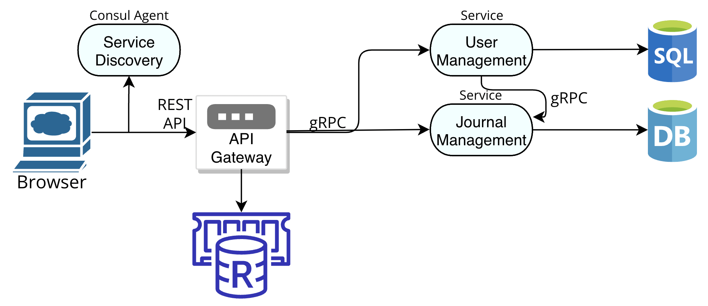

# Project: Online Journaling Application
A platform that allows users to create, store, and manage personal journal entries. Users can write about their thoughts, experiences, and reflections in a digital format. Implementing such an application using microservices architecture involves breaking down the various components and functionalities of the app into separate, independent services.

Microservices may be relevant and necessary for such an application because of the following concepts:

1. **Scalability**: the application can experience varying levels of user activity. Microservices allow scaling specific components independently. For instance, the user registration/authentication service can be scaled separately from the journaling service to handle spikes in user activities.
2. **Independent Development**: the developer can update certain components of the application independently, such as add features to user authentication, or enhance journaling functionality without affecting other parts of the application.
3. **Technology Diversity**: Different components of the application may require different technologies or databases. Microservices offer the flexibility to choose the best technology stack for each service.
4. **Fault Isolation**: if one service of the application fails or encounters issues, it doesn't necessarily bring down the entire system. Users can still access other parts of the app, such as reading existing journal entries, while the problematic service is fixed.
5. **Easier Maintenance**: Maintenance becomes more manageable when you can focus on individual services. You can update, patch, or troubleshoot one service without disrupting the entire application.
    

Real-world examples of well-known projects that employ microservices include:

1. **Facebook**: Facebook utilizes a microservices architecture to manage various aspects of its platform. Different services handle user authentication, news feed generation, messaging, and more. This enables Facebook to scale and maintain its massive user base efficiently.
2. **Netflix**: Netflix is another prime example. It employs microservices to manage its extensive content library, user recommendations, and streaming services. This architecture enables Netflix to adapt quickly to user preferences and handle a global user base.
3. **Uber**: Uber relies on microservices to power its ride-sharing platform. Different services handle driver matching, ride tracking, payments, and more. This architecture has allowed Uber to expand rapidly and adapt to diverse market needs.
    

## **Application Services:**

1. User Creation & Maintenance
2. Journal Entries Creation & Maintenance
    



**Technology Stack:** Golang, Python, Gin, Gorm, gRPC, REST API

**Deployment:** Docker

## Endpoints

### Register User
POST request with the purpose of user registration. It sends a JSON payload containing a username and password for a user account creation.
#### Method: POST
>```
>http://127.0.0.1:5000/users/register
>```
#### Headers

|Content-Type|Value|
|---|---|
|Content-Type|application/json|
|Accept|application/json|

#### Body (**raw**)

```json
{
    "username":"test0",
    "password":"test0"
}
```

#### Response (**raw**)

```json
{
    "message":"User successfully created"
}
```

### Delete User
DELETE request intended to delete a user account, including authentication using a bearer token in the "Authorization" header, and the request body provides the user's password as a security measure to confirm the user's identity.
#### Method: DELETE
>```
>http://127.0.0.1:5000/users/delete
>```
#### Headers

|Content-Type|Value|
|---|---|
|Content-Type|application/json|
|Accept|application/json|

#### Body (**raw**)

```json
{
    "username":"test0",
    "password":"test0"
}
```

#### Response (**raw**)

```json
{
    "message":"User successfully deleted"
}
```

### Create Journal Entry
POST request to create a new journal entry for a specific user. It sends a JSON payload containing the username, title, and description of the new entry, along with authorization using a bearer token.
#### Method: POST
>```
>http://127.0.0.1:5000/entries/create
>```
#### Headers

|Content-Type|Value|
|---|---|
|Content-Type|application/json|
|Accept|application/json|

#### Body (**raw**)

```json
{
    "username":"test0",
    "title":"aaa",
    "content":"aaa"
}
```

#### Response (**raw**)

```json
{
    "message":"Journal entry successfully added"
}
```

### Get User's Journal Entries
GET request to retrieve a user's journal entries.
#### Method: GET
>```
>http://127.0.0.1:5000/entries/test0
>```
#### Headers

|Content-Type|Value|
|---|---|
|Accept|application/json|

#### Response (**raw**)

```json
{
    "entries": [
        {
            "title":"aaa",
            "content":"aaa"
        }
    ]
}
```
